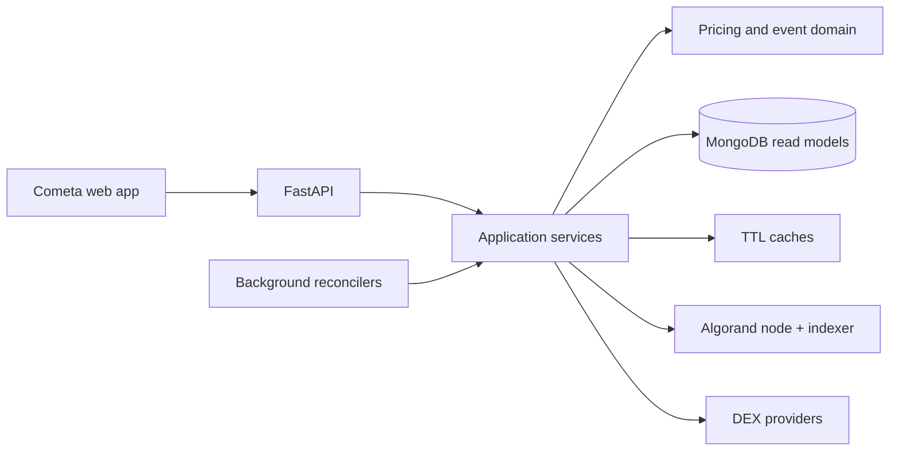

<p align="center">
  
</p>

<h1 align="center">Cometa Backend</h1>

<p align="center">
  <strong>Reliability-oriented Python backend powering Cometa on Algorand.</strong><br />
  Reconciles on-chain state, derives precision-safe prices across multiple DEXes,
  and serves wallet, pool, staking, and TVL read models through FastAPI.
</p>

<p align="center">
  <a href="https://github.com/MetaLabsOG/cometa-backend/actions/workflows/ci.yml"></a>
  <a href="https://www.python.org/"></a>
  <a href="https://fastapi.tiangolo.com/"></a>
  <a href="https://developer.algorand.org/"></a>
  <a href="https://api.cometa.farm/status"></a>
</p>

<p align="center">
  <a href="https://app.cometa.farm/">Live product</a>
  · <a href="https://api.cometa.farm/status">API health</a>
  · <a href="#architecture">Architecture</a>
  · <a href="CONTRIBUTING.md">Contributing</a>
  · <a href="SECURITY.md">Security</a>
</p>

---

Cometa is an Algorand DeFi platform for discovering and interacting with farms,
staking programs, liquidity pools, and token markets. This service turns several
eventually consistent data sources—Algorand nodes, the indexer, DEX APIs, and
MongoDB—into stable, query-oriented API models for the product frontend.

## Why this repository is interesting

| Engineering concern | Implementation |
| --- | --- |
| **Financial precision** | Prices use validated `Decimal` value objects; LP balances, fees, and canonical asset supply retain the full Algorand `uint64` domain through BSON-safe storage. |
| **Crash-safe projections** | Scoped event cursors, fee-specific IDs, per-state compare-and-set writes, immutable markers, and a fenced round checkpoint make LP replay convergent across crashes and competing workers. |
| **Replay-safe payouts** | Airdrops and NFT transfers persist immutable signed intent before broadcast, cap signer fees, bind the configured genesis hash, keep terminal states monotonic, and fail closed on pre-intent lottery history. |
| **Resilient price routing** | Vestige and Tinyman payloads are validated with provenance and bounded staleness; retry classification and a guarded Vestige refresh prevent failure storms. |
| **Operational boundaries** | Selected blocking chain calls leave the event loop; deterministic failures use bounded retry; unverified staking is fail-closed and the raw-balance LP price publisher has been removed. |
| **Versioned chain decoding** | Reach 0.1.11 state is decoded natively from Algorand with explicit per-version layouts, exact-width integers, and fail-closed schema validation. |
| **Supply-chain hardening** | The digest-pinned Alpine image is multi-stage, non-root, and Python-only; CI smoke-tests it and rejects high/critical vulnerabilities or embedded secrets. |

The codebase combines a production system's real constraints with incremental
modernization: pure domain modules and strict typing sit beside legacy adapters,
and the quality gate expands as those adapters gain isolated test seams.

## Architecture



FastAPI routes are intentionally thin at the newer boundaries. Application
services coordinate refresh and fallback behavior; domain modules own invariants;
adapters isolate storage, chain, and provider-specific details. The optional
legacy Reach runtime has been replaced with a small native decoder: supported
farm and distribution versions map packed Algorand global and local state into
the existing API view shape without private npm packages or a second runtime.
The decision and extension rules are documented in
[`docs/architecture/native-reach-state.md`](docs/architecture/native-reach-state.md).
Financial write paths are documented separately in
[`docs/architecture/outbound-asset-transfers.md`](docs/architecture/outbound-asset-transfers.md)
and [`docs/architecture/lp-projection.md`](docs/architecture/lp-projection.md).
The latest internal multi-agent engineering review, including resolved and
intentionally open items, is in
[`docs/audit/01-audit-architecture-financial-2026-07-19.md`](docs/audit/01-audit-architecture-financial-2026-07-19.md).

### Reliability boundaries

| Boundary | Policy |
| --- | --- |
| Provider quote → stored price | Positive, finite decimal values with source and observation timestamp |
| Cached price → API response | Explicit freshness window; expired data is rejected instead of silently relabelled |
| Chain event → LP read model | Full-block preflight, fee-aware uint64 ledger, CAS cursor, marker repair, and round fencing |
| Raw LP account balance → price | Prohibited; economic reserves require a verified DEX-specific adapter |
| Asset payout → Algorand | Validate genesis and fee ceiling; persist signed intent first; rebroadcast identical bytes; reconcile before completion |
| Selected sync chain SDK → async request path | Bounded executor hand-off |
| Permanent provider error → retry loop | Typed classification prevents pointless retries |
| Half-open circuit → provider | A single probe prevents a recovery stampede |
| Reach bytes → public view | Exact key, step, size, tag, and contract-version validation |

## Quick start

### Requirements

- Python 3.12 and [Pipenv](https://pipenv.pypa.io/) for the production-equivalent environment
- Python 3.14 is also exercised by CI as a forward-compatibility gate
- MongoDB
- access to an Algorand node/indexer

```bash
git clone https://github.com/MetaLabsOG/cometa-backend.git
cd cometa-backend
cp .env.example .env
make sync
pipenv run python -c \
  'from algosdk import account, mnemonic; key, _ = account.generate_account(); print(mnemonic.from_private_key(key))'
# Put this throwaway phrase in ALGO_MNEMONIC. Never fund or reuse the account.
# Point MONGODB_HOST, ALGOD_ADDRESS, and ALGO_INDEXER_ADDRESS at dev services.
make run-api
```

`make run-api` is the safe API-only development loop. `make run` executes the
production-equivalent entrypoint: critical indexes,
optional migrations when `MIGRATE=true`, configured workers, and Uvicorn. For
the full entrypoint, review every worker flag first. A development mnemonic is
still required by legacy Python transaction adapters; use a generated, unfunded
account only.

Verify the service:

```bash
curl --fail http://127.0.0.1:8000/status
# {"version":"2.1.0","algo_network":"mainnet"}
```

For a containerized environment:

```bash
docker compose up -d --build
docker compose logs -f app
```

This Compose stack starts persistent MongoDB and a full Algorand node. Inspect
the network, volume paths, and validated `MONGODB_IMAGE`/`ALGOD_IMAGE` values
before using it outside an isolated development host.

## Quality gate

```bash
make quality
```

This single command runs:

- Ruff linting and formatting checks;
- strict mypy checks on modern domain boundaries;
- the complete Python test suite with branch coverage, including deterministic Reach
  state-codec and security-boundary tests.

CI repeats those checks on Python 3.12 and 3.14 for every pull request and every
push to `main`, verifies the lockfile and Compose configuration, builds and
smoke-tests the production image, scans it with Trivy, and exercises financial
repository invariants against a digest-pinned MongoDB service. A pinned
TruffleHog gate fetches and scans every published Git ref for verified or unresolved
credentials and feeds the stable required `python` status. The focused
coverage ratchet is currently 75%;
it measures maintained domain and infrastructure modules rather than presenting
a misleading whole-repository number.

Useful individual targets are `make lint`, `make format-check`,
`make typecheck`, and `make test`.

## API snapshot

| Endpoint | Purpose |
| --- | --- |
| `GET /status` | Liveness, version, and configured Algorand network |
| `GET /contracts` | Farm and distribution catalog |
| `GET /contracts/user/{address}` | Contracts associated with a wallet |
| `GET /contracts/farm/enriched` | Contracts enriched with asset metadata and prices |
| `POST /assets/price` | Read stored bounded-fresh prices; optional `ids` accepts up to 250 values, while omission returns all stored projections |
| `POST /lp/state/priced` | Read LP token prices; missing or stale batch entries are returned as `null` |
| `GET /stats/tvl` | Protocol TVL snapshot |

The production API intentionally disables interactive OpenAPI pages. Endpoint
changes must remain compatible with the linked frontend; see
[`CONTRIBUTING.md`](CONTRIBUTING.md) for the cross-project checklist.

## Repository map

```text
app.py                 FastAPI composition, routes, and lifespan
api/                   Product-facing API and background orchestration
blockchain/            Algorand node and indexer adapters
core/                  Shared authentication, persistence, and resilience
dexes/                 DEX-specific integrations
flex/application/      Use-case orchestration
flex/blockchain/       Versioned Algorand and Reach-state decoding
flex/domain/           Pure pricing and transaction invariants
flex/providers/        Market-data provider adapters
flex/db/               MongoDB models, repositories, and indexes
tests/unit/            Fast regression and boundary tests
tests/integration/     Opt-in tests against disposable real services
scripts/               Deployment and legacy operational utilities
```

## Configuration and security

Runtime configuration is defined in `env.py` and loaded from environment
variables. `.env.example` contains names and safe placeholders only. Never commit
wallet mnemonics, API tokens, `.env` files, database exports, unredacted logs, or
recovery artifacts.

Report vulnerabilities privately using the process in
[`SECURITY.md`](SECURITY.md). For development conventions, regression-test
expectations, and the pull-request checklist, see
[`CONTRIBUTING.md`](CONTRIBUTING.md).
