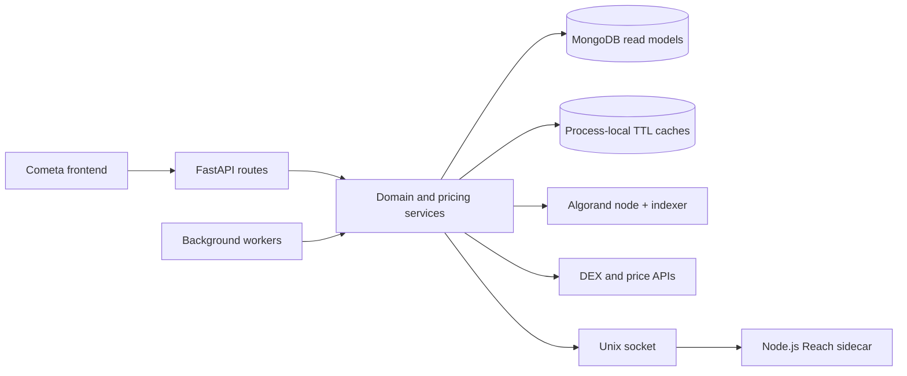

# Cometa Backend

[](https://github.com/MetaLabsOG/cometa-backend/actions/workflows/ci.yml)
[](https://www.python.org/)
[](https://fastapi.tiangolo.com/)

Production backend for **Cometa**, an Algorand DeFi platform that aggregates farms, staking programs, liquidity pools, wallet positions, and token prices across multiple DEXes.

This repository is primarily a data and orchestration service: it normalizes on-chain state, enriches it with market data, maintains read models in MongoDB, and exposes a stable API to the Cometa frontend.

## Engineering Highlights

- Multi-source price routing across Vestige, Tinyman, Pact, and HumbleSwap.
- Executor wrappers around synchronous Algorand SDK calls in latency-sensitive paths.
- Background workers for contract state, asset prices, LP reserves, and pool synchronization.
- In-process TTL caches and MongoDB indexes for hot lookups; Redis integration remains roadmap work.
- Python-to-Node.js interoperability over a bounded Unix socket protocol for Reach SDK operations.
- Constant-time API-key verification and a strict production CORS allowlist.
- Single-operation MongoDB upserts with explicit unique-index requirements and regression tests.

## Architecture



The API serves query-oriented read models while workers reconcile external state. Several provider paths use fallbacks; uniform timeout, stale-data, and exactly-once projection semantics are tracked as explicit architecture work rather than hidden assumptions.

## Repository Layout

| Path | Responsibility |
| --- | --- |
| `app.py` | FastAPI application, routes, startup, and process orchestration |
| `api/` | Background tasks, wallet logic, statistics, and notifications |
| `blockchain/` | Algorand node/indexer adapters |
| `core/` | Shared domain logic, authentication, caching, and persistence |
| `dexes/` | DEX-specific integrations |
| `flex/` | Asset, pool, price, transaction, and migration pipelines |
| `js/` | Reach/Algorand SDK sidecar |
| `scripts/` | Deployment, backup, recovery, and diagnostic tools |
| `tests/` | Fast, isolated regression tests |

## Local Development

Requirements: Python 3.12, Pipenv, Node.js 22, MongoDB, and access to an Algorand node/indexer.

```bash
cp .env.example .env
# Fill the required credentials locally; never commit .env.
pipenv sync --dev
pipenv run python app.py
```

For API-only route development without migrations, workers, or the JS sidecar, use
`pipenv run uvicorn app:app --reload --port 8000`.

Run the complete local quality gate:

```bash
pipenv run pytest --cov=core.decorators --cov=flex.db.classes.collection_manager \
  --cov-report=term-missing --cov-fail-under=50
pipenv run ruff check env.py core/decorators.py flex/__init__.py \
  flex/db/classes/collection_manager.py \
  scripts/verify_algorand_credentials.py tests
npm --prefix js test
```

Lint and coverage are intentionally ratcheted: new and refactored modules are clean, and the initial 50% focused coverage floor must only move upward as legacy code gains seams.

For the containerized stack:

```bash
docker-compose up -d --build
docker-compose logs -f app
```

## API Surface

Representative endpoints:

| Endpoint | Purpose |
| --- | --- |
| `GET /status` | Service version and Algorand network |
| `GET /contracts` | Farm/distribution contract catalog |
| `GET /contracts/user/{address}` | Contracts used by a wallet |
| `GET /contracts/farm/enriched` | Contracts enriched with assets and prices |
| `POST /assets/price` | Batch asset pricing |
| `POST /lp/state/priced` | LP token price data |
| `GET /stats/tvl` | Protocol TVL snapshot |

Interactive OpenAPI endpoints are currently disabled for every environment. The canonical frontend-to-backend contract is maintained in the parent Cometa platform documentation.

## Configuration and Security

All runtime settings are defined in `env.py` and loaded from environment variables. `.env.example` contains names and safe placeholders only. Private npm access uses `NODE_AUTH_TOKEN`; Algorand credentials are checked with:

```bash
pipenv run python scripts/verify_algorand_credentials.py
```

Never commit mnemonics, API keys, `.env` files, or generated recovery data. Credentials used by historical maintenance scripts must be rotated before publishing a repository, even after the files are removed from the current tree.

## Testing and Delivery

GitHub Actions runs pinned Python tooling, unit tests with coverage, focused Ruff checks, and the Node.js test command on every pull request and push to `main`. New fixes should include a regression test, with priority given to:

1. deterministic replay and idempotency of financial events;
2. price freshness and provider fallback behavior;
3. contract registration and API authorization;
4. integer-safe handling of on-chain amounts.

See [`AGENTS.md`](AGENTS.md) for contribution conventions and `docs/audit/01-audit-codebase-2026-07-17.md` for the prioritized architecture roadmap.
