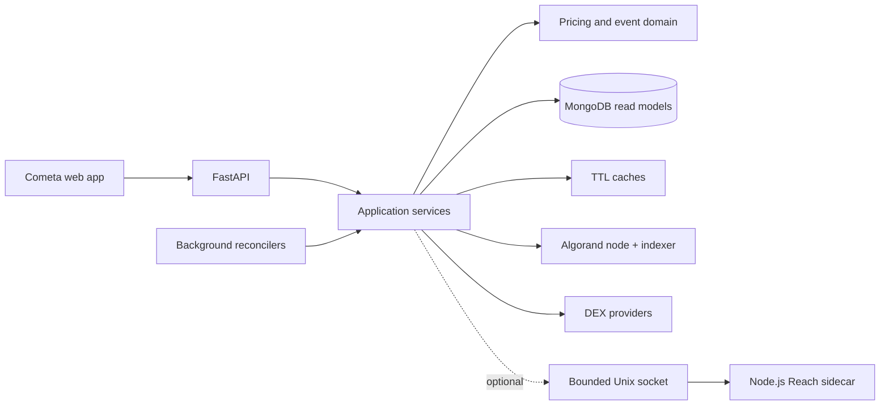

<p align="center">
  
</p>

<h1 align="center">Cometa Backend</h1>

<p align="center">
  <strong>Reliability-oriented Python backend powering Cometa on Algorand.</strong><br />
  Reconciles on-chain state, derives precision-safe prices across multiple DEXes,
  and serves wallet, pool, staking, and TVL read models through FastAPI.
</p>

<p align="center">
  <a href="https://github.com/MetaLabsOG/cometa-backend/actions/workflows/ci.yml"></a>
  <a href="https://www.python.org/"></a>
  <a href="https://fastapi.tiangolo.com/"></a>
  <a href="https://developer.algorand.org/"></a>
  <a href="https://api.cometa.farm/status"></a>
</p>

<p align="center">
  <a href="https://app.cometa.farm/">Live product</a>
  · <a href="https://api.cometa.farm/status">API health</a>
  · <a href="#architecture">Architecture</a>
  · <a href="CONTRIBUTING.md">Contributing</a>
  · <a href="SECURITY.md">Security</a>
</p>

---

Cometa is an Algorand DeFi platform for discovering and interacting with farms,
staking programs, liquidity pools, and token markets. This service turns several
eventually consistent data sources—Algorand nodes, the indexer, DEX APIs, and
MongoDB—into stable, query-oriented API models for the product frontend.

## Why this repository is interesting

| Engineering concern | Implementation |
| --- | --- |
| **Financial precision** | Prices use validated `Decimal` value objects, carry source and observation time, and cross the legacy `float` boundary only explicitly. |
| **Deterministic replay identity** | Nested Algorand transfers receive stable, projection-scoped event IDs; unique indexes guard price and event-marker collections. Crash-atomic projection remains roadmap work. |
| **Resilient price routing** | Vestige and Tinyman payloads are validated with provenance and bounded staleness; retry classification and a guarded Vestige refresh prevent failure storms. |
| **Operational boundaries** | Selected latency-sensitive SDK calls leave the event loop through executors; background workers reconcile chain state without coupling reads to refresh latency. |

The codebase combines a production system's real constraints with incremental
modernization: pure domain modules and strict typing sit beside legacy adapters,
and the quality gate expands as those adapters gain isolated test seams.

## Architecture



FastAPI routes are intentionally thin at the newer boundaries. Application
services coordinate refresh and fallback behavior; domain modules own invariants;
adapters isolate storage, chain, and provider-specific details. The optional
Node.js sidecar performs Reach SDK operations and is disabled by default.

### Reliability boundaries

| Boundary | Policy |
| --- | --- |
| Provider quote → stored price | Positive, finite decimal values with source and observation timestamp |
| Cached price → API response | Explicit freshness window; expired data is rejected instead of silently relabelled |
| Chain event → read model | Deterministic identity plus unique persistence constraints |
| Sync SDK → async request path | Bounded executor hand-off |
| Permanent provider error → retry loop | Typed classification prevents pointless retries |
| Half-open circuit → provider | A single probe prevents a recovery stampede |

## Quick start

### Requirements

- Python 3.12 and [Pipenv](https://pipenv.pypa.io/)
- MongoDB
- access to an Algorand node/indexer
- Node.js 22 for the full quality gate and optional sidecar

```bash
git clone https://github.com/MetaLabsOG/cometa-backend.git
cd cometa-backend
cp .env.example .env
make sync
pipenv run python -c \
  'from algosdk import account, mnemonic; key, _ = account.generate_account(); print(mnemonic.from_private_key(key))'
# Put this throwaway phrase in ALGO_MNEMONIC. Never fund or reuse the account.
# Point MONGODB_HOST, ALGOD_ADDRESS, and ALGO_INDEXER_ADDRESS at dev services.
make run
```

`make run` starts Uvicorn with reload on port `8000`. Keep `ENABLE_JS=false`
unless you have access to the private sidecar packages and provide a read-only
`NODE_AUTH_TOKEN`. A development mnemonic is currently required because legacy
signing adapters derive an address at import time; use a generated, unfunded
account only.

Verify the service:

```bash
curl --fail http://127.0.0.1:8000/status
# {"version":"2.1.0","algo_network":"mainnet"}
```

For a containerized environment:

```bash
docker compose up -d --build
docker compose logs -f app
```

## Quality gate

```bash
make quality
```

This single command runs:

- Ruff linting and formatting checks;
- strict mypy checks on modern domain boundaries;
- the complete Python test suite with branch coverage;
- Node.js contract/configuration tests.

CI repeats those checks on every pull request and every push to `main`, verifies
the lockfile, and validates the Compose configuration. The focused coverage
ratchet is currently 75%; it measures maintained domain and infrastructure
modules rather than presenting a misleading whole-repository number.

Useful individual targets are `make lint`, `make format-check`,
`make typecheck`, `make test`, and `make test-js`.

## API snapshot

| Endpoint | Purpose |
| --- | --- |
| `GET /status` | Version and Algorand network health |
| `GET /contracts` | Farm and distribution catalog |
| `GET /contracts/user/{address}` | Contracts associated with a wallet |
| `GET /contracts/farm/enriched` | Contracts enriched with asset metadata and prices |
| `POST /assets/price` | Batch asset pricing |
| `POST /lp/state/priced` | Batched LP reserve and price data |
| `GET /stats/tvl` | Protocol TVL snapshot |

The production API intentionally disables interactive OpenAPI pages. Endpoint
changes must remain compatible with the linked frontend; see
[`CONTRIBUTING.md`](CONTRIBUTING.md) for the cross-project checklist.

## Repository map

```text
app.py                 FastAPI composition, routes, and lifespan
api/                   Product-facing API and background orchestration
blockchain/            Algorand node and indexer adapters
core/                  Shared authentication, persistence, and resilience
dexes/                 DEX-specific integrations
flex/application/      Use-case orchestration
flex/domain/           Pure pricing and transaction invariants
flex/providers/        Market-data provider adapters
flex/db/               MongoDB models, repositories, and indexes
js/                    Optional Reach/Algorand sidecar
tests/unit/            Fast regression and boundary tests
scripts/               Deployment and safe operational utilities
```

## Configuration and security

Runtime configuration is defined in `env.py` and loaded from environment
variables. `.env.example` contains names and safe placeholders only. Never commit
wallet mnemonics, API tokens, `.env` files, database exports, unredacted logs, or
recovery artifacts.

Report vulnerabilities privately using the process in
[`SECURITY.md`](SECURITY.md). For development conventions, regression-test
expectations, and the pull-request checklist, see
[`CONTRIBUTING.md`](CONTRIBUTING.md).
